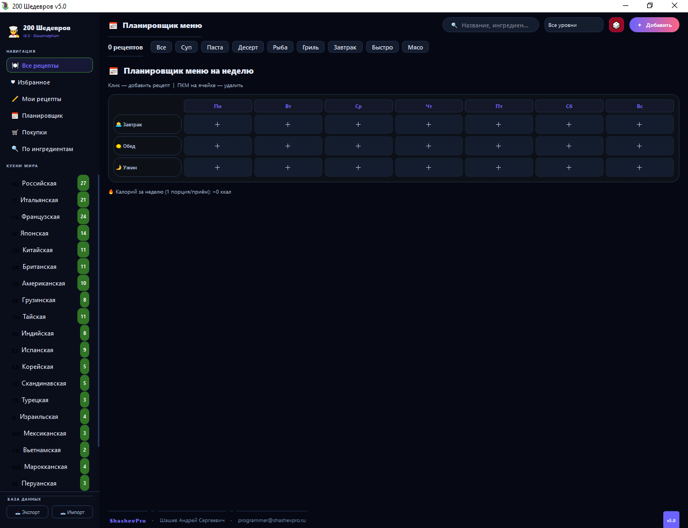
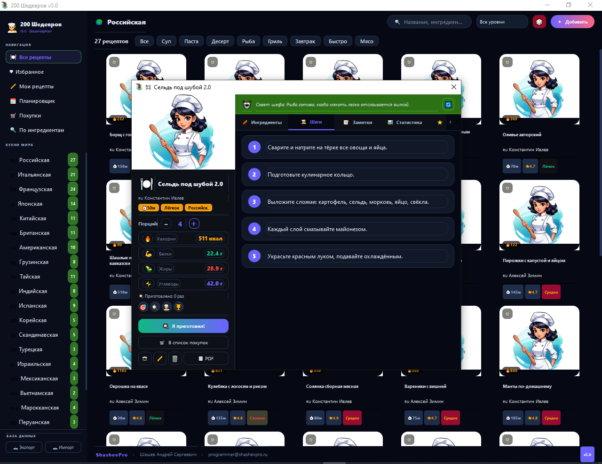
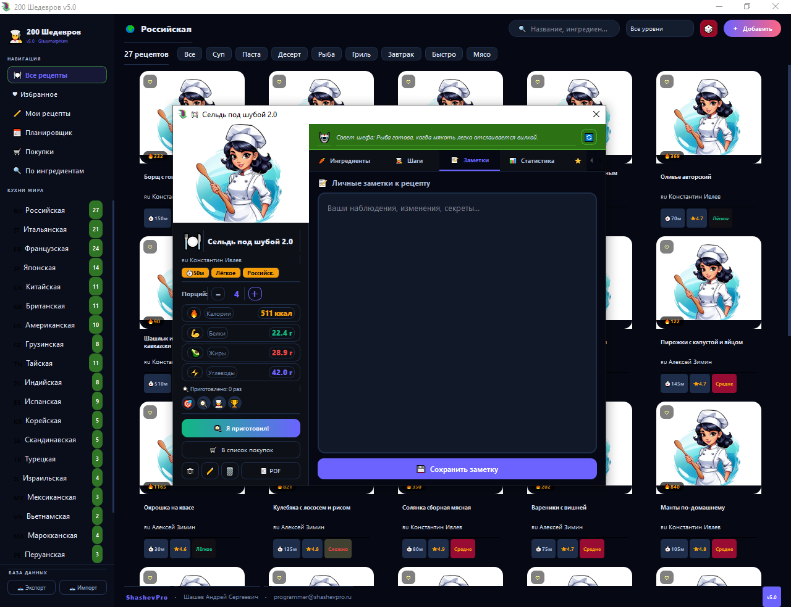
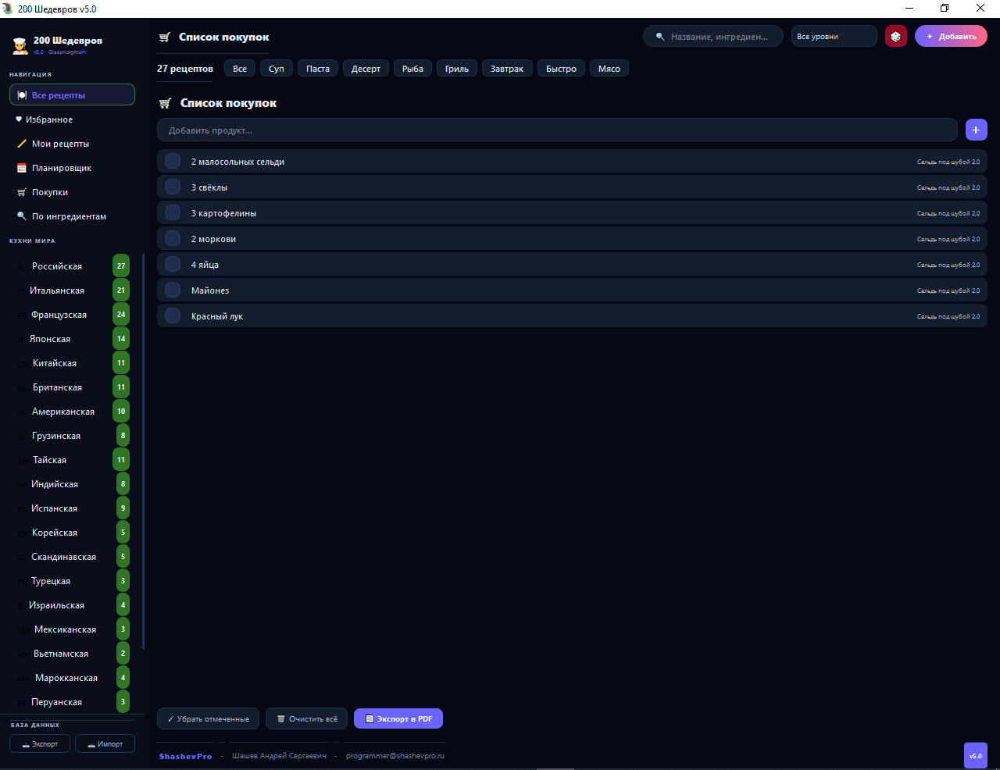
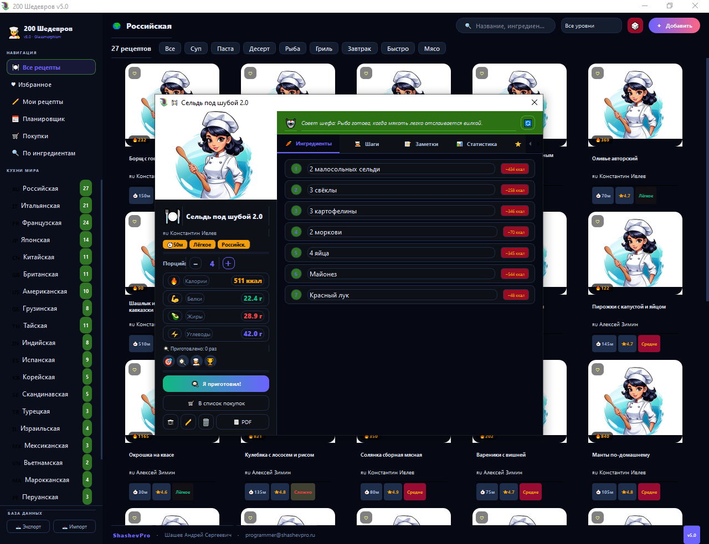
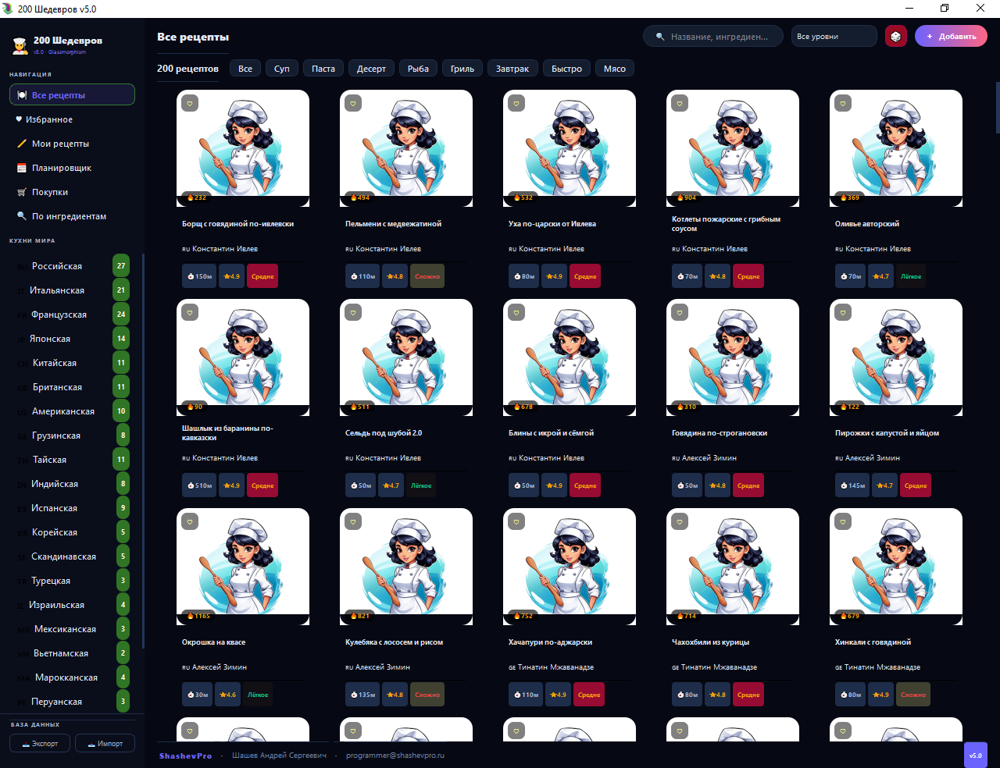

# 200 ШЕДЕВРОВ v5.0 — Кулинарная книга нового уровня

### A next-level desktop cookbook for Windows


---

Полноценное десктопное приложение — кулинарный помощник с 200 авторскими рецептами, 38 шеф-поварами мирового уровня и 23 кухнями мира. Тёмная тема, умный поиск, планировщик меню, расчёт КБЖУ и список покупок с экспортом в PDF.

A full-featured desktop cookbook — 200 recipes from 38 world-class chefs across 23 cuisines. Dark UI, smart search, weekly meal planner, nutrition calculator, and PDF shopping list export.

---

## 🖥 Screenshots

 
 
 

---

## ✨ Возможности · Features

- **200 авторских рецептов** от Гордона Рамзи, Джейми Оливера, Нобу Мацухисы, Массимо Боттуры, Константина Ивлева и других
- **23 кухни мира** — фильтрация по кухне в боковой панели
- **Умный поиск** — по названию, ингредиентам и описанию
- **Поиск по ингредиентам** — введи что есть в холодильнике, получи подходящие рецепты
- **Карточка рецепта** — ингредиенты с КБЖУ, пошаговые шаги, заметки, статистика приготовлений
- **Автоматический расчёт КБЖУ** — калории, белки, жиры, углеводы на порцию
- **Регулировка порций** — все ингредиенты пересчитываются автоматически
- **Планировщик меню на неделю** — завтрак, обед, ужин на каждый день
- **Список покупок** — формируется автоматически из рецептов, экспорт в PDF
- **Избранное и Мои рецепты** — добавляй свои блюда
- **Тёмная тема** — комфортная работа при любом освещении
- **Экспорт / импорт базы** — перенос данных между компьютерами
- Portable — один EXE, без установки

---

## 📁 Структура · Structure

```
cookbook_app/
├── main.py              # Entry point
├── CookBook2026.py      # App bootstrap
├── database/            # SQLAlchemy models and repositories
├── gui/                 # PyQt6 windows and widgets
├── assets/              # Images and icons
├── hook_runtime.py      # PyArmor runtime hook
├── make_spec.py         # PyInstaller spec generator
├── build.bat            # Full build script (PyArmor BCC + PyInstaller)
└── icon.ico             # Application icon
```

---

## 🚀 Запуск из исходников · Run from source

```bash
pip install PyQt6 sqlalchemy
python main.py
```

Requires Python 3.11.

---

## 📦 Сборка EXE · Build EXE

```bash
build.bat
```

Скрипт автоматически: создаёт venv, устанавливает зависимости, обфусцирует через PyArmor BCC, собирает через PyInstaller 6.11.0.

The script automatically creates a venv, installs dependencies, obfuscates with PyArmor BCC, and builds with PyInstaller 6.11.0.

> **Требования для сборки:** PyArmor group license, clang.exe по пути `C:\Users\Andrey\.pyarmor\clang.exe`. При использовании на другом компьютере скорректируй пути в `build.bat`.

Ready `.exe` is available in [Releases](../../releases).

---

## ⚙️ Стек · Stack

- Python 3.11, PyQt6
- SQLite + SQLAlchemy ORM
- PyArmor BCC + PyInstaller 6.11.0
- ReportLab (PDF export)

---

## 🌐 Author

**Andrey Shashev · ShashevPro**

- 🌐 [shashevpro.ru](https://www.shashevpro.ru)
- 🛒 [kwork.ru/user/shashevpro](https://kwork.ru/user/shashevpro)
- 💬 [vk.com/shashevpro](https://vk.com/shashevpro)
- ✉️ programmer@shashevpro.ru

---

*MIT License · © ShashevPro*
